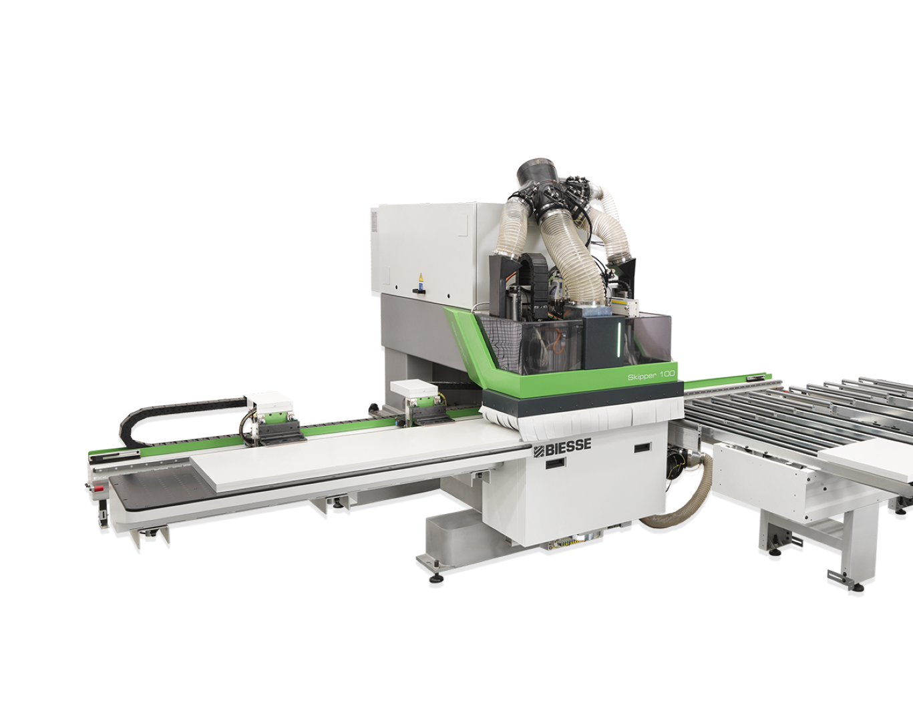

# BIESSE Skipper 100

Обрабатывающий центр SKIPPER 100 является станком для высококачественной, точной присадки изделий из плитного материала ЛДСП, МДФ. Станок оборудован двумя рабочими присадочными группами – нижней и верхней, имеющими в общей сложности 78 автономных инструментальных шпинделей. Станок может производить одновременную обработку двух панелей, причем, и сверху, и снизу в рамках одного рабочего цикла.

## Характеристики

  {{ read_excel('skipper 100.xlsx') }}

## УП

### (TTP) Тип инструмента
  - **NORMALE** - «тупое/глухое» (для отверстий :material-diameter-variant: 5-12 мм. На зажимах отверстия :material-diameter-variant: 8 мм прописывают :material-diameter-variant: 7 мм)

  - **NORMALEG** - «тупое/глухое» (для отверстий :material-diameter-variant: 15, 20, 35 мм)

  - **LANCIA** -  «острое/сквозное» (используется для наколок 8 x 1 мм) 

### Переменные заготовки

* **Данные пользователя**

     * **PMOD**

        * 0 нижние шпиндели
        * 1 верхние шпиндели
        * 2 опозитная обработка

     * **NPAN**

        * 1 выгрузка на стол загрузки
        * 2 выгрузка на стол разгрузки

## Пароли    

  

    

      

        

          
        

        

          
        

      

    

    <button class="itc-slider__btn itc-slider__btn_prev"></button>
    <button class="itc-slider__btn itc-slider__btn_next"></button>
  

## Файлы
  * [BiesseWorks 3.4.27.10](https://disk.yandex.com/d/abpKgCAsme_xHw)
  
  * [Брошюра](<5808A1080_Bs_Cat Skipper 100_mar23_RUS_Lr.pdf>)

  * [Key](<./images/key_biesse_editor.jpg>){target="_blank"}

<!-- /////////////////////////////////////////////////////////////////////////////////////////// -->
<!-- /////////////////////////////////////////////////////////////////////////////////////////// -->
<!-- /////////////////////////////////////////////////////////////////////////////////////////// -->

  

<link href="../stylesheets/itc-slider.css" rel="stylesheet">
