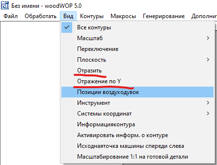
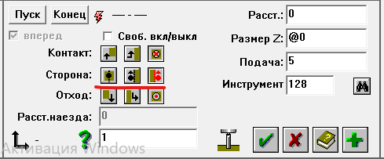

# WEEKE BHC350 / Venture
## УП
### Инструменты
  * Наколки :material-diameter-variant: 5,2 x 1 мм
  
  * Фреза > Инструмент №140
??? warning "Предупреждение"
    При использовании функций "Отразить" и "Отражение по Y", отражается и сторона коррекции.
     

## Файлы
  * [WoodWOP](https://disk.yandex.com/d/TJKstsXMf-yTAw)
